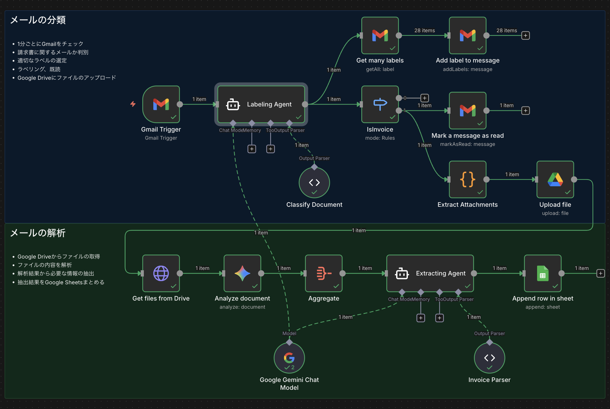

# n8nで請求書を管理する

## 概要

Gmailで受信した請求書をGoogle Driveにアップロードすると、請求書の内容を解析してGoogle Sheetsに追加するワークフローです。

## 使い方

1. `workflow.json` をn8nにインポートしてください。

2. 以下のアカウント及び認証情報の設定が必要です。

    - Gmail OAuth2 API
    - Google Drive OAuth2 API
    - Google Sheets OAuth2 API
    - Google Gemini(PaLM) API

    Googleの認証情報の設定はこちらから：https://console.cloud.google.com

    Google Gemini(PaLM) APIの認証情報の設定はこちらから：https://aistudio.google.com/

## お問い合わせ

お問い合わせは以下のメールアドレスまでお願いします。

info@humanai.co.jp